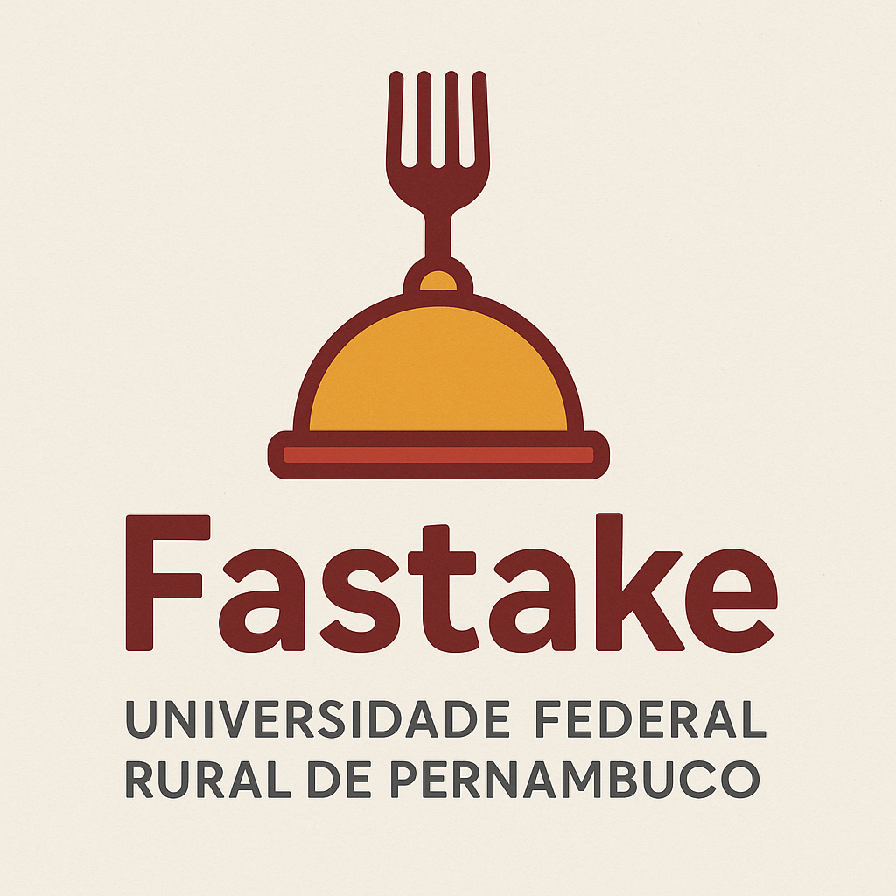
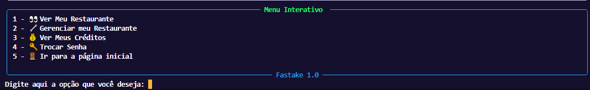

# Projeto-Fastake.UFRPE
# Fastake




Fastake é um software feito em python que vai tornar mais rápido, fácil e flexível a experiência de frequentar restaurantes, permitindo que usuários comprem tickets antecipadamente e evitem filas e esperas.

O software se divide em 4 arquivos principais : 

## adm.py
Esse arquivo concentra as funções que o administrador pode realizar, desde o cadastro até a edição de restaurantes do mesmo, oferecendo organização e dividindo em métodos todas as ações do administrador.

## usuario.py
Esse arquivo concentra as funções que o usuário pode realizar, partindo do cadastro e login até a exclusão de conta e manipulação de dados, assim como a visualização de alterações realizadas pelo administrador nos restaurantes, em conjunto com o sistema de compra específico.

## restaurantes.py
Esse arquivo concentra as etapas percorridas, pelo usuário, ao entrar na aba de restaurantes, onde o mesmo pode ver os restaurantes, ver os seus pratos, finalizar a compra e gerar um ticket pessoal, onde será armazendo no banco de dados.

## main.py
Esse arquivo relaciona todos os outros em um só, por isso é tratado como principal, aplicando todos os métodos das classes e organizando de acordo com as escolhas que o usuário realiza ao longo do programa, oferecendo diferentes opções e experiências.

## Requisitos
-Python 3.8 ou superior

-É necessário instalar a biblioteca "mysql-connector-python".

```bash
pip install mysql-connector-python
```

## Uso para usuário

O sistema dá a possibilidade de comprar tickets dos restaurantes participantes, para que ao chegar ao local não precise perder tempo fazendo o pedido, só apresentar o ticket.

Caso você já planeje comer em um restaurante mais de uma vez, há a possibilidade de comprar quantos tickets desejar, pois eles ficam armazenados para serem usados quando desejado.


## Imagem do menu interativo para o usuário comum, com todas as funções e ações  que o mesmo pode realizar

## Uso para administradores

O sistema possibilita que o administrador cadastre seu restaurante, adicione os pratos, as bebidas, seus valores, e caso deseje, exclua o restaurante da plataforma.

Quando o usuário comprar ticket do restaurante, o dinheiro é atribuido à conta cadastrada pelo administrador.





## Imagem do menu interativo para o administrador, com todas as funções e ações  que o mesmo pode realizar com seus estabelecimentos


## Funcionalidades

1 - Cadastro de usuário (CRUD Completo): 

        - Possuindo validação de CPF, senha e geração de código, bem como verificação da existência de tal CPF informado dentro do sistema.

2 - Validador de Login: 
 
    - Em um banco de dados contendo um escopo de usuários cadastrados haverá a validação de: 
        - Analisar se o CPF está na lista dos cadastrados.
        
        - Analisar se a senha está correta de acordo com o CPF.
        
        - Se a senha estiver incorreta, solicitar o login novamente e dar opção de esquecer senha.

3 - Esquecimento de senha: 
 
    - Pedir para informar o código pessoal de recuperação e solicitar uma nova senha.
    
    - No banco de dados trocar a senha antiga pela nova.

4 - Menu Interativo: 

    - Será solicitado ao usuário que o mesmo insira uma opção válida e haverá validações, sendo elas:
        - Se há espaços vazios (se há exatamente o número relacionado a função desejada).
        
        - Opções válidas: 1 - Trocar senha ; 2 - Ver crédito ; 3 - Ver restaurantes ; 4 - Ver tickets ; 5 - Deletar conta ; 6  - Ir para a página de login.

5 - Adicionar Créditos: 

     - Será mostrado ao usuário sua quantidade de créditos e perguntará se o mesmo deseja adicionar mais créditos, se sim, será solicitada a quantia desejada, ocorrendo uma validação para verificar se há apenas números.
     
     - Será solicitado ao usuário a forma de pagamento (simulação de pagamento), sendo opções válidas 1, 2 ou 3 (1 - Pix ; 2 - Cartão de Crédito ; 3 - Cartão de Débito) e por fim, será feita a adição dos créditos no banco de dados.

6 - Escolha de Restaurantes: 

    - Será solicitado ao usuário a escolha dentre os restaurantes parceiros ; opções válidas são iguais à quantidade de restaurantes (Cada um representado por um número inteiro começando do 1).
    
    - Será apresentado o cardápio do restaurante escolhido ao usuário.
    
    - Será solicitada a escolha dentre as opções disponíveis.

7 - Finalizar Compra: 

    
    - Descontar crédito: 
        O valor total da compra será descontado automaticamente do valor creditado pelo usuário.
        
    - Gerar ticket:
        Irá gerar um ticket aleatório, de 5 dígitos, para o usuário, onde será armazenado relacionando o ID do usuário no banco de dados com o ID do prato escolhido.

    - Funcionalidade de Inovação devido à implementação do sistema de ticket's que serão armazenados dentro da aba do usuário, podendo ser utilizado em dias posteriores à compra do mesmo, se diferenciando da consumação imediata padrão do mercado

8 - Cadastrar como Administrador: 

    - No cadastro inicial dar a opção de ir para a aba de administrador e realizar o cadastro, utilizando-se do email e solicitação de um senha, de 4 dígitos, do administrador.

9 - Login como Administrador: 

    - Realizar o Login com as informações fornecidas no cadastro, através de um Read no banco de dados, para a partir disso começar a gerenciar o restaurante através de um menu interativo próprio para Administradores.

10 - Menu Interativo para gerenciar restaurantes:
    - Menu interativo completo para administradores, onde o mesmo pode adicionar restaurantes, gerenciá-los e até exclui-los, além disso pode manipular suas próprias informações, como trocar a senha.

11 - Modularizar o código-fonte: 

    - Estruturar o código de forma a separá-lo em diferentes arquivos, onde serão acessados, a partir de um arquivo principal, por importações de suas respectivas classes e funções, oferecendo organização e fácil reconhecimento de estruturas dentro do código, favorecendo a posterior evolução e aprimoramento do sistema de forma ágil e dinâmica.

12 - Programação Orientada a Objetos: 

    - Como já foi dito na seção 2.2 da Metodologia e Desenvolvimento, a Orientação a Objetos do código é de suma importância para uma maior organização e estruturação do mesmo, trazendo especificidade e atribuição de características e ações a um mesmo objeto, evitando a confusão interna entre os fluxos de dados e a repetição de estruturas recorrentes dentro do sistema, a exemplo dos métodos, toda ação que um usuário pode realizar dentro da plataforma, que moldam a experiência do cliente e se repetem o tempo todo.

13 - Rich :
        - Estilização do terminal para uma experiência agradável e atrativa para o usuário.
## Bibliotecas  Utilizadas


1 - Time:
        - Utilizada para evitar a continuidade, sem espaçamento, do código, oferecendo uma maior interação com o usuário e as informações disponíveis.

2 - Random: 
        - Utilizada para gerar códigos aleatórios referentes a cadastros e tickets dos restaurantes.

3 - Rich:
        - Biblioteca usada para estilizar o terminal e deixá-lo mais agradável, intuitivo e chamativo para o usuário.

4 - EmailValidator:
        - Utilizado para validar os emails dos administradores, na hora do cadastro, para garantir o formato correto : 'email@email.com'.

## Como executar

Siga os passos abaixo para executar o sistema Fastake:

1. **Clone o repositório:**

```bash
git clone https://github.com/seuusuario/fastake.git
cd fastake
```
2. **Instale as dependências:**

```bash
pip install mysql-connector-python
```
3. **Execute o programa:**
```bash
python main.py
```
## Fluxogramas do projeto

drive: https://drive.google.com/drive/folders/1uhIA0sC4zEqgwUyi6rsmgmzCkKmg3L7M?usp=drive_link

## Artigo do projeto

https://drive.google.com/file/d/14W-V3qhiJk0kQV6W5qeDVyxCWpkPfSsd/view?usp=sharing

## Autores

Matheus Cintra: https://github.com/CintraMatheus

João Marcelo: https://github.com/joaomcoutinho

## Status do projeto

Projeto concluído.

